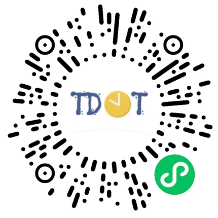
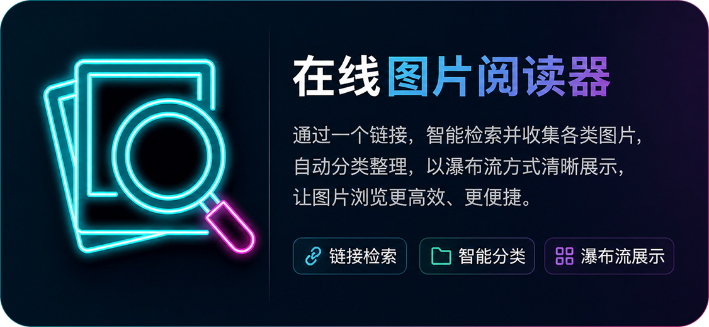
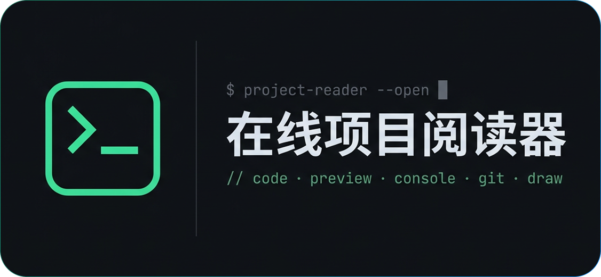
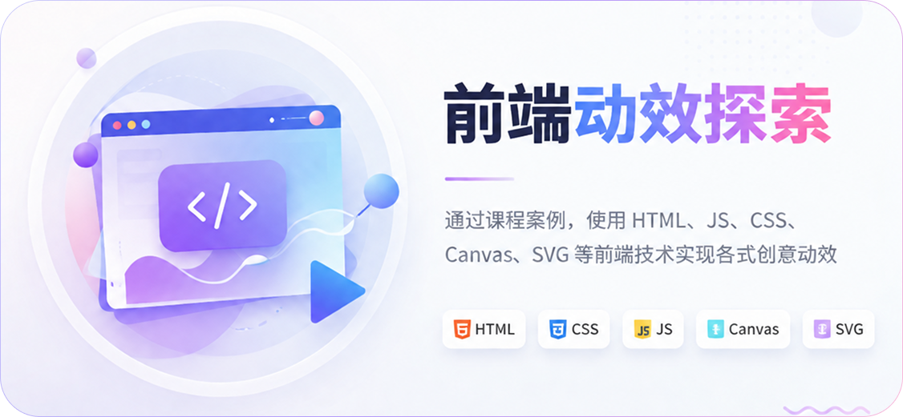
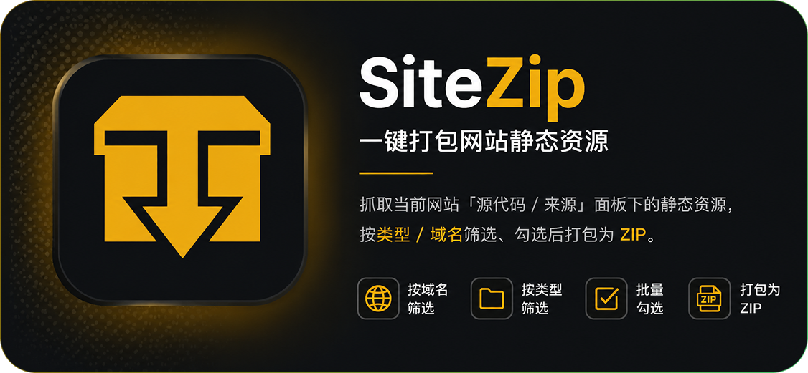

<!-- 动态打字效果 -->
<h1 align="center">
  
</h1>

<!-- 个人资料徽标 -->

  

### ✨ **_Hi_** ✨

> **Languages**

  
  
  
  
  
  
  
  

> **Interested**

  
  
  
  
  
  
  
  
  

---

> 💬 **_My Projects_** 💬

  

  <a href="https://hz.urest.top" target="_blank">
    
  </>
  &nbsp;&nbsp;&nbsp;
  <a href="https://image.urest.top" target="_blank">
    
  </>

  <a href="https://svg.urest.top" target="_blank">
    
  </>
  &nbsp;&nbsp;&nbsp;
  <a href="https://code.urest.top" target="_blank">
    
  </>

  <a href="https://web.urest.top" target="_blank">
    
  </>
  &nbsp;&nbsp;&nbsp;
  <a href="https://github.com/cgbin24/SiteZip" target="_blank">
    
  </>

&emsp;&emsp;

> The only thing that matters is what you choose to be now. 
你当下所做的选择才最为重要。
